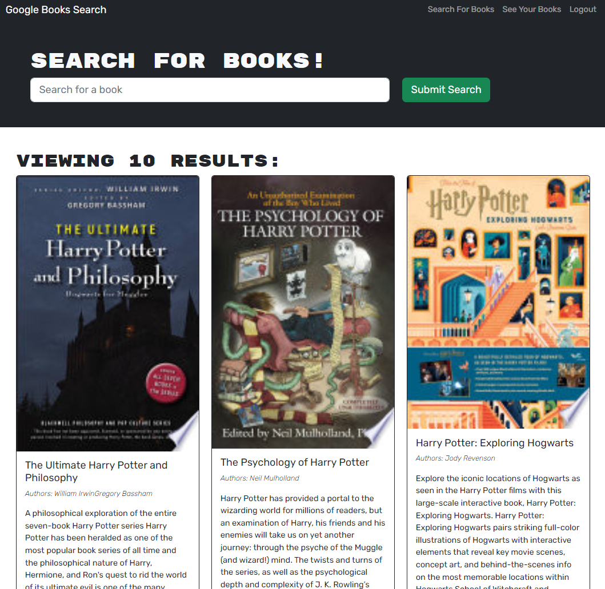

# MERN Book Search

This is a web application that allows users to search for books using the Google Books API. The application provides users with a search bar where they can input their queries, and the search results are displayed on the same page.

# Table of Contents

- [Installation](#Installation)
- [Usage](#Usage)
- [Technologies](#Technologies)

# Installation

To install this application, you will need to clone the repository onto your local machine. Once you have cloned the repository, navigate to the root directory of the project and run the following command in your terminal to install the dependencies:

`npm i;`

You can then run the server using `npm run develop;`. The application should automatically open in a new tab.

# Usage

To use the app, simply type in a search term and click the "Search" button. The app will fetch results from the Google Books API and display them on the page. You can click on any book to view more details, and you can save books by clicking the "Save" button.

# Technologies

This application was built using the following technologies:

- React
- Google Books API
- Bootstrap
- GraphQL
- MongoDB

# Screenshot

